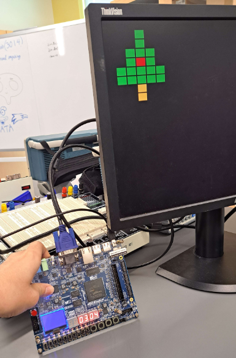
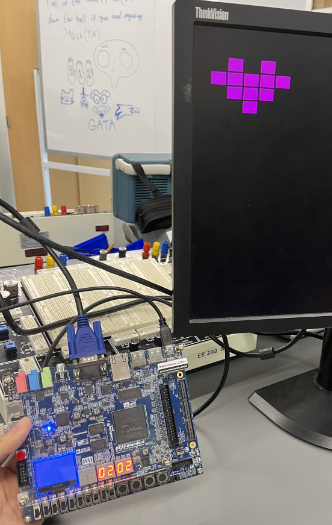

<!-- Improved compatibility of back to top link: See: https://github.com/othneildrew/Best-README-Template/pull/73 -->

<!--
*** Thanks for checking out the Best-README-Template. If you have a suggestion
*** that would make this better, please fork the repo and create a pull request
*** or simply open an issue with the tag "enhancement".
*** Don't forget to give the project a star!
*** Thanks again! Now go create something AMAZING! :D
-->

<!-- PROJECT SHIELDS -->
<!--
*** I'm using markdown "reference style" links for readability.
*** Reference links are enclosed in brackets [ ] instead of parentheses ( ).
*** See the bottom of this document for the declaration of the reference variables
*** for contributors-url, forks-url, etc. This is an optional, concise syntax you may use.
*** https://www.markdownguide.org/basic-syntax/#reference-style-links
-->

<!-- PROJECT LOGO -->
 

<h1 align="center">Pixel Art Tool</h1>

  

    Final project for Digital Design Lab that use DE-10 FPGA board and VHDL to create a program that can color blocks on a monitor.
  

<!-- TABLE OF CONTENTS -->

  
Table of Contents

  <ol>
    <li>
      <a href="#about-the-project">About The Project</a>
      <ul>
        <li><a href="#built-with">Built With</a></li>
      </ul>
    </li>
    <li>
      <a href="#getting-started">Getting Started</a>
      <ul>
        <li><a href="#prerequisites">Prerequisites</a></li>
        <li><a href="#installation">Installation</a></li>
      </ul>
    </li>
    <li><a href="#usage">Usage</a></li>
    <li><a href="#roadmap">Roadmap</a></li>
    <li><a href="#contributing">Contributing</a></li>
    <li><a href="#license">License</a></li>
    <li><a href="#contact">Contact</a></li>
    <li><a href="#acknowledgments">Acknowledgments</a></li>
  </ol>

<!-- ABOUT THE PROJECT -->
## About The Project

* In this project, our goal was to design a tool that would allow the user to “paint” onto the display of a computer monitor 
* To accomplish this design, we had to combine our knowledge of VHDL, FPGA, and the DE-10 board, along with new knowledge of VGA, or “Video Graphics Array”
* By combining these concepts, we were able to develop a device that enables the user to move through a grid on the monitor, and apply colors to the blocks on the grid using the buttons and switches on the DE-10 board

  
    
  <a href="https://youtu.be/IaCkFQVwQhc">View Demo Video</a>

(<a href="#readme-top">back to top</a>)

### Built With

* Intel Quartus Prime Lite
* DE-10 Standard FPGA

(<a href="#readme-top">back to top</a>)

<!-- GETTING STARTED -->
## Getting Started

1. Create a new Quartus Project
2. Download and add VGA.vhd file to the Quartus project folder

### Hardware Requirement 

* DE-10 Standard FPGA
* VGA Cable
* Monitor

(<a href="#readme-top">back to top</a>)

<!-- USAGE EXAMPLES -->
## Pin Assignment

  

(<a href="#readme-top">back to top</a>)

<!-- ACKNOWLEDGMENTS -->
## Acknowledgments

* 
* 
* 

(<a href="#readme-top">back to top</a>)

